# DVWA XSS Lab

## 项目介绍

本项目基于 DVWA（Damn Vulnerable Web Application）搭建 Web 安全测试环境，使用 Burp Suite 对 XSS（Cross Site Scripting，跨站脚本攻击）漏洞进行手工测试与漏洞复现。

本项目主要完成：

- Reflected XSS 反射型 XSS
- Stored XSS 存储型 XSS
- XSS Filter Bypass 过滤绕过
- DOM XSS 前端 DOM 型 XSS
- Burp Suite 抓包分析
- Repeater 手工修改 Payload
- XSS Payload 构造与验证

---

## 技术栈

- Docker
- DVWA
- Burp Suite
- JavaScript
- HTML
- HTTP
- XSS

---

## 项目环境

- Windows 10
- Docker Desktop
- DVWA
- Burp Suite Community Edition
- Google Chrome

---

## 项目结构

```text
dvwa_xss_lab/
│
├── README.md
│
├── payloads/
│   └── xss_payloads.txt
│
├── reports/
│   └── xss_report.md
│
└── screenshots/
    ├── xss_reflected_page.png
    ├── xss_reflected_alert.png
    ├── burp_xss_request.png
    ├── burp_xss_repeater_response.png
    ├── stored_xss_page.png
    ├── stored_xss_alert.png
    ├── stored_xss_persistent.png
    ├── burp_stored_xss_request.png
    ├── burp_stored_xss_response.png
    ├── xss_filter_block.png
    ├── xss_bypass_success.png
    ├── burp_filter_response.png
    ├── dom_xss_page.png
    ├── dom_xss_alert.png
    └── burp_dom_xss_request.png
```

---

## DVWA 环境启动

进入 DVWA 项目目录后，启动 Docker：

```bash
docker compose up -d
```

浏览器访问：

```text
http://localhost:4280
```

登录账号：

```text
admin
```

登录密码：

```text
password
```

---

## 实验内容

### 1. Reflected XSS

进入：

```text
XSS (Reflected)
```

测试 Payload：

```html
<script>alert(1)</script>
```

当页面弹出 `1` 时，说明反射型 XSS 成功。

---

### 2. Stored XSS

进入：

```text
XSS (Stored)
```

在留言框中输入：

```html
<script>alert(1)</script>
```

提交后刷新页面，如果仍然弹窗，说明 Payload 已经被存储到数据库中。

---

### 3. XSS Filter Bypass

将 DVWA Security 设置为 Medium，测试基础 Payload 是否被过滤。

测试绕过 Payload：

```html

```

以及：

```html
<svg onload=alert(1)>
```

用于验证网站只过滤 `<script>` 时仍然可能被其他 HTML 事件绕过。

---

### 4. DOM XSS

进入：

```text
XSS (DOM)
```

测试 URL 参数：

```text
default=<script>alert(1)</script>
```

编码形式：

```text
%3Cscript%3Ealert%281%29%3C%2Fscript%3E
```

DOM XSS 的核心在于前端 JavaScript 读取 URL 参数并写入页面，导致浏览器执行恶意脚本。

---

## 实验截图

### Reflected XSS 页面

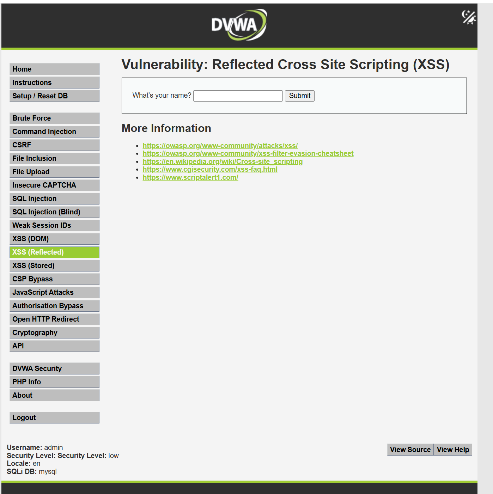

---

### Reflected XSS 弹窗成功

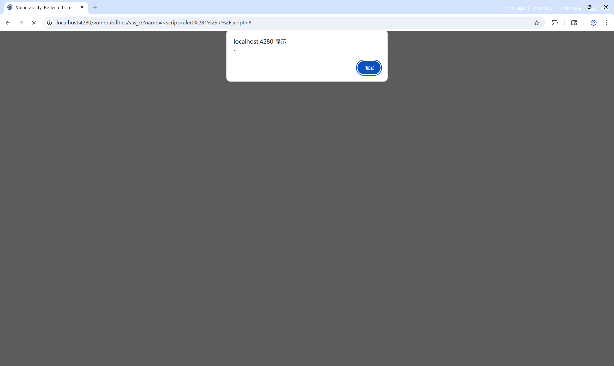

---

### Burp 抓取 Reflected XSS 请求

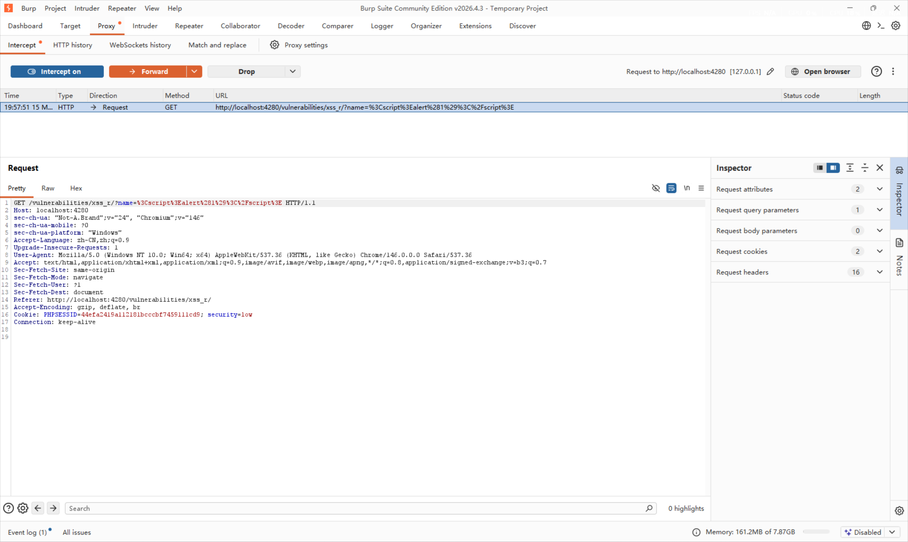

---

### Burp Repeater 返回结果

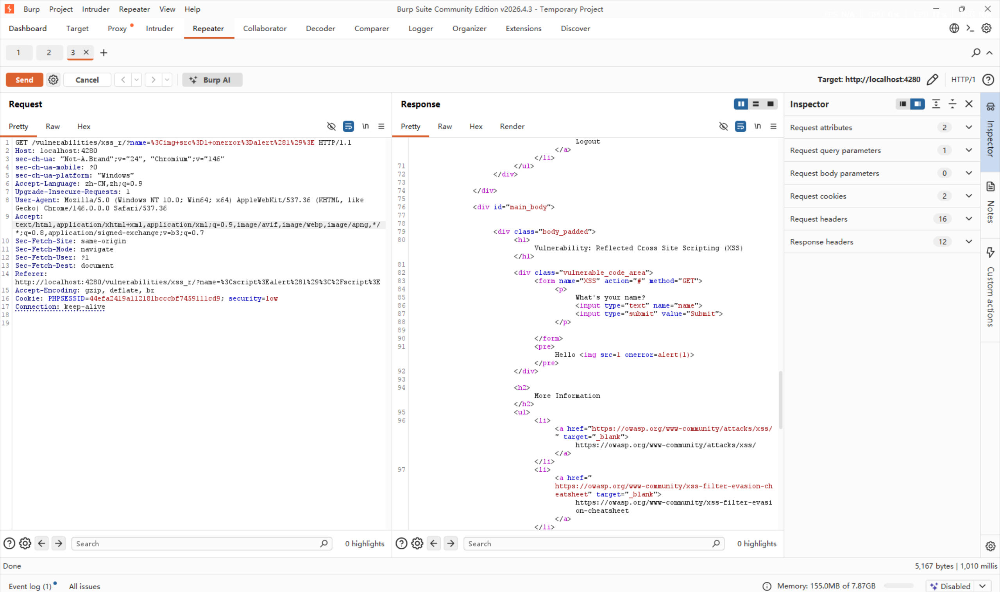

---

### Stored XSS 页面

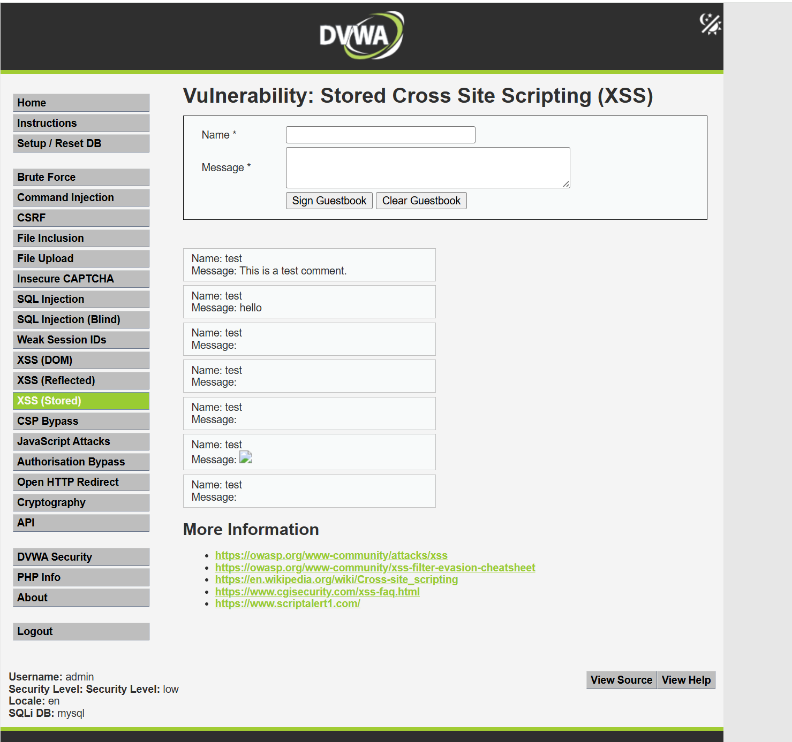

---

### Stored XSS 弹窗成功

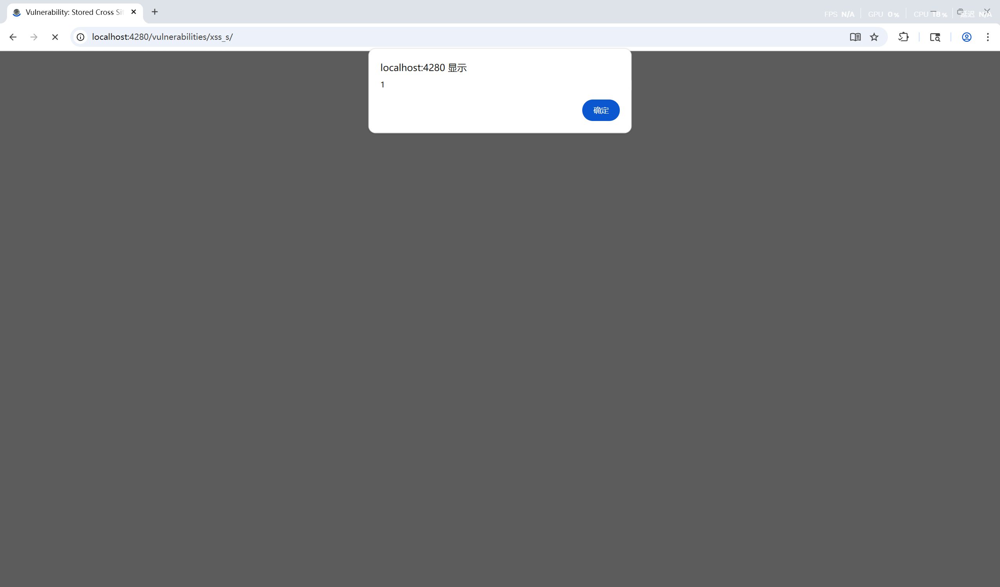

---

### Stored XSS 持久化效果

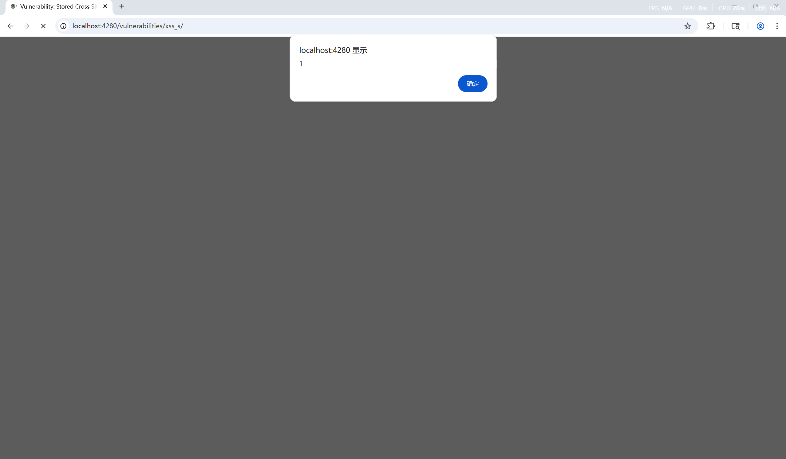

---

### Burp 抓取 Stored XSS 请求

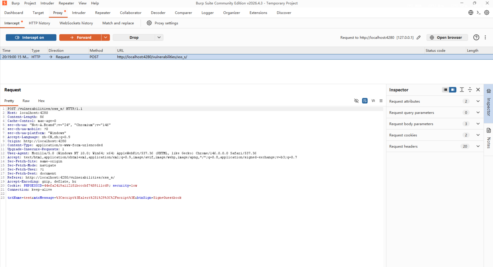

---

### Burp Stored XSS 返回结果

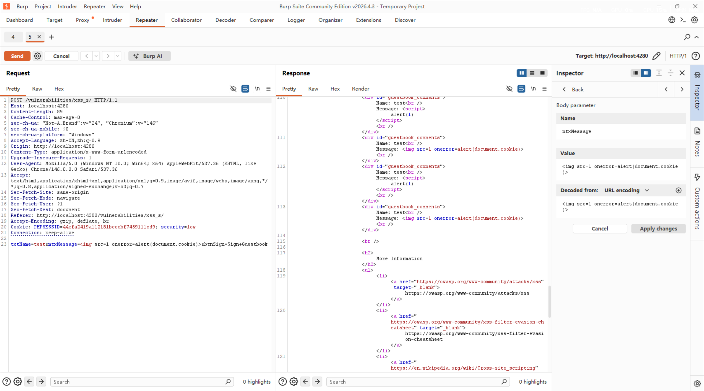

---

### XSS 过滤阻断

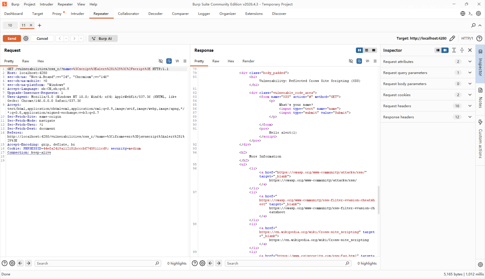

---

### XSS 绕过成功

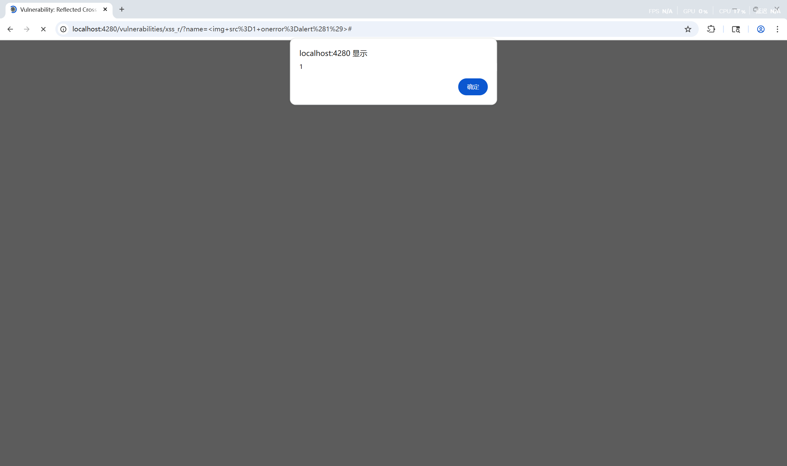

---

### Burp 过滤响应分析

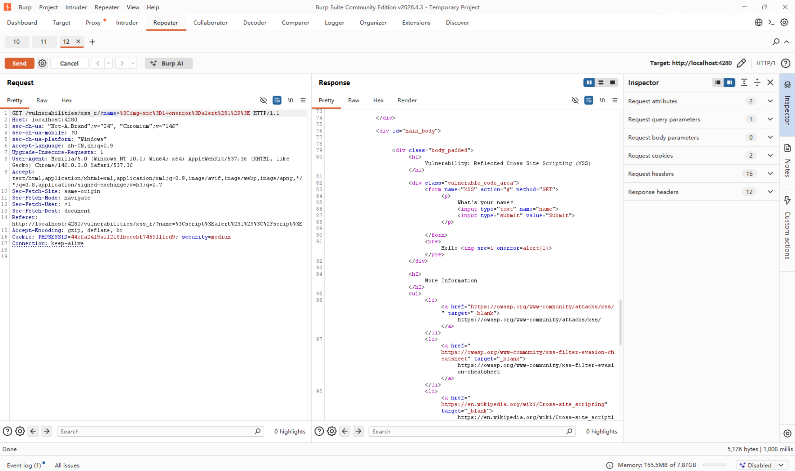

---

### DOM XSS 页面

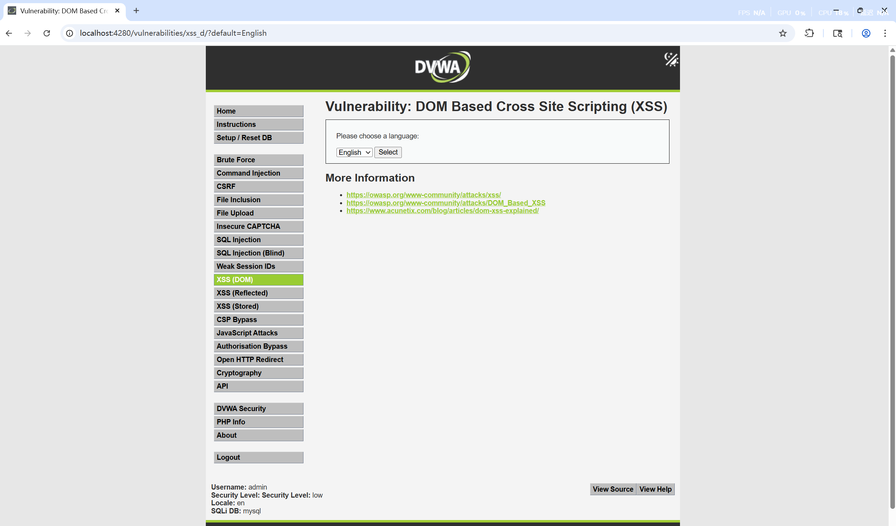

---

### DOM XSS 弹窗成功

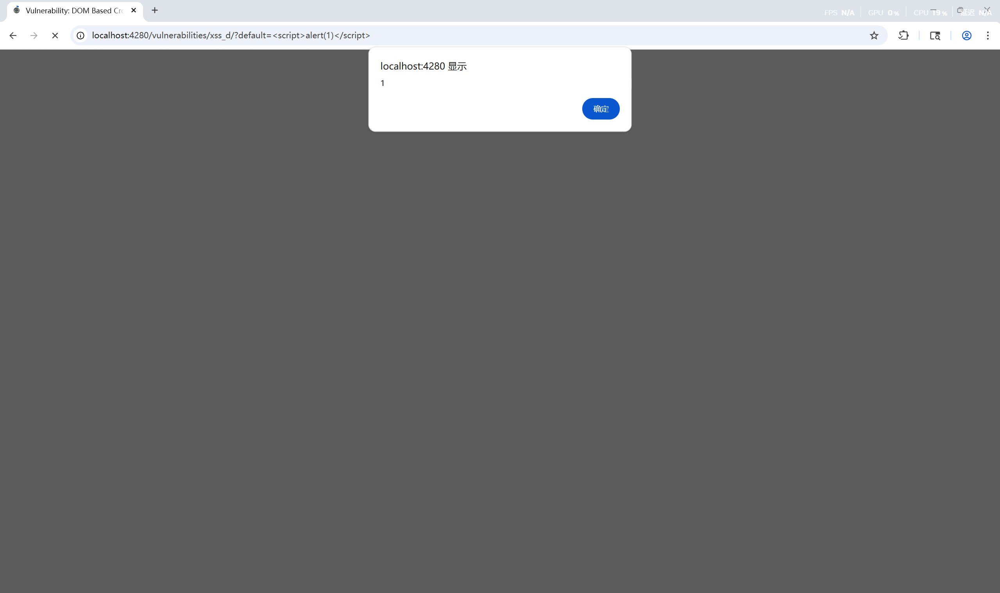

---

### Burp 抓取 DOM XSS 请求

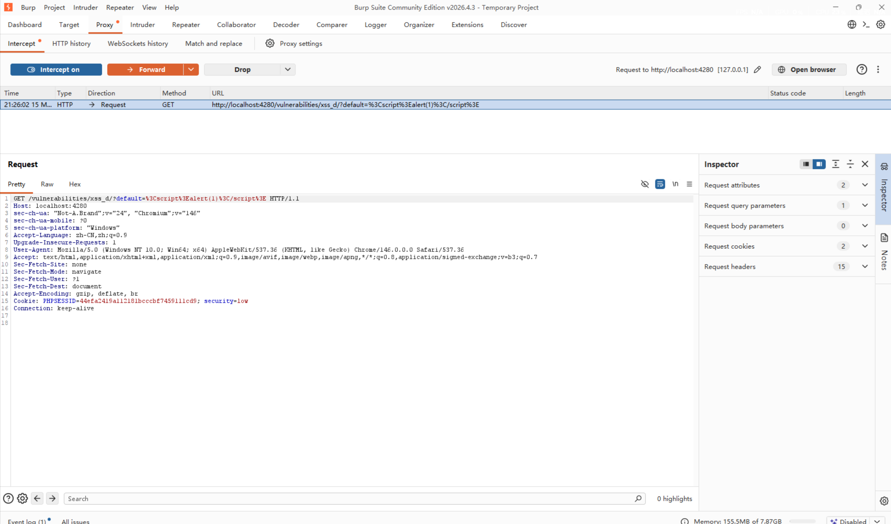

---

## 漏洞报告

详细实验过程与漏洞分析：

```text
reports/xss_report.md
```

---

## Payload 文件

XSS Payload 记录：

```text
payloads/xss_payloads.txt
```

---

## 项目总结

本项目完成了 DVWA 中 XSS 漏洞的基础复现与分析，包括反射型 XSS、存储型 XSS、过滤绕过以及 DOM XSS。

通过本项目，掌握了：

- XSS 漏洞基本原理
- JavaScript Payload 构造
- HTML 事件触发机制
- Burp Suite 抓包分析
- Repeater 手工测试
- URL 编码分析
- DOM XSS 基础原理

---

## 免责声明

本项目仅用于 Web 安全学习、漏洞复现和安全研究，禁止用于任何非法用途。